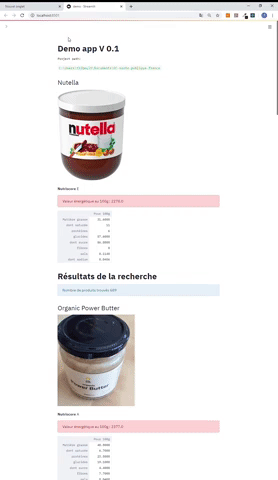

sante_publique_france
==============================

Educational purpose project in data sciences. Build an application to help people to eat healthier food.

Project Organization
------------

    ├── LICENSE
    ├── Makefile           <- Makefile with commands like `make data`
    ├── README.md          <- The top-level README for developers using this project.
    ├── data
    │   ├── interim        <- Intermediate data that has been transformed.
    │   ├── processed      <- The final, canonical data sets for modeling.
    │   └── raw            <- The original, immutable data dump.
    │
    ├── docs               <- A default Sphinx project; see sphinx-doc.org for details
    │
    ├── notebooks          <- Jupyter notebooks. Naming convention is a number (for ordering),
    │                         the creator's initials, and a short `-` delimited description, e.g.
    │                         `1.0-jqp-initial-data-exploration`.
    │
    ├── reports            <- Generated analysis as HTML, PDF, LaTeX, etc.
    │   └── figures        <- Generated graphics and figures to be used in reporting
    │
    ├── requirements.txt   <- The requirements file for reproducing the analysis environment, e.g.
    │                         generated with `pip freeze > requirements.txt`
    │
    ├── setup.py           <- makes project pip installable (pip install -e .) so src can be imported
    ├── src                <- Source code for use in this project.
        ├── __init__.py    <- Makes src a Python module
        │
        ├── data           <- Scripts to download data
        │   └── make_dataset.py
        |
        ├── demo_app       <- Code for demo app using streamlit
        │   └── demo.py    <- `~ streamlit run ./src/demo_app/demo.py`
        │
        └── visualization  <- Code contening wrappers for visualizations in notebooks
            └── visualize.py

Features
----------

  * Data processing (see Notebooks and src)
  * Demo app (see src/demo_app/demo.py)

  * reports (see reports/)

--------

<small>Project based on the <a target="_blank" href="https://drivendata.github.io/cookiecutter-data-science/">cookiecutter data science project template</a>. #cookiecutterdatascience</small>

